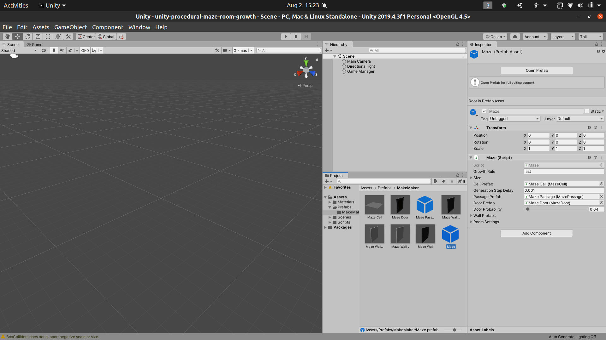
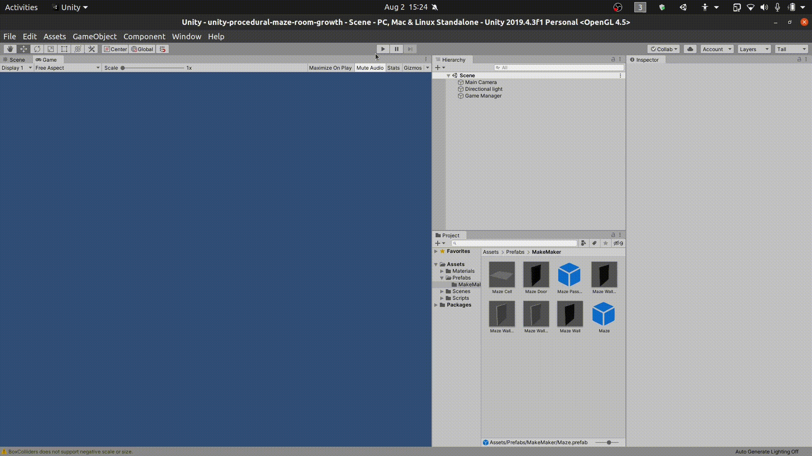

Procedural Indoor Room Layout Generation using Growth Algorithm
================

### work in progress ...

This is partial implementation of [tutorial](https://catlikecoding.com/unity/tutorials/maze/) by [catlikecoding](https://catlikecoding.com/).

---

